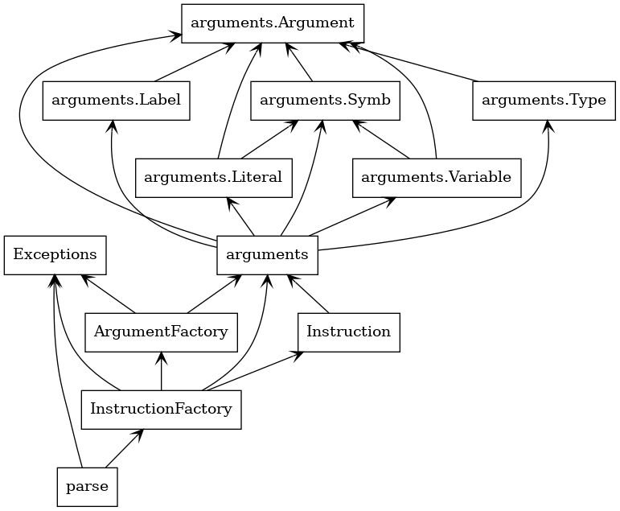

# parse.py README

## Code Analyzer for IPPcode24 (parse.py)

The filter script (parse.py in Python 3.10) reads the source code in IPPcode24 from the standard input (see section 5), checks the lexical and syntactic correctness of the code, and prints the XML representation of the program according to the specification in section 3.1 on the standard output.

This script will work with these parameters:
- `--help` see the common parameter of all scripts in section 2.2.

Error return codes specific to the analyzer:
- `21` - incorrect or missing header in the source code written in IPPcode24;
- `22` - unknown or incorrect operation code in the source code written in IPPcode24;
- `23` - other lexical or syntactic error of the source code written in IPPcode24.

## Description of the output XML format

After the mandatory XML header, the root element `program` follows (with the mandatory text attribute `language` with the value `IPPcode24`), which contains `instruction` elements for instructions. Each `instruction` element contains a mandatory `order` attribute with the order of the instruction. When generating elements, the order is numbered from 1 in a contiguous sequence. The element also contains a mandatory `opcode` attribute (the value of the operation code is always in uppercase in the output XML) and elements for the corresponding number of operands/arguments: `arg1` for a possible first argument of the instruction, `arg2` for a possible second argument, and `arg3` for a possible third argument of the instruction. The element for the argument has a mandatory `type` attribute with possible values `int`, `bool`, `string`, `nil`, `label`, `type`, `var` depending on whether it is a literal, label, type, or variable, and contains a text element.

This text element then carries either the value of the literal (already without specifying the type and without the @ sign), the name of the label, the type, or the identifier of the variable (including the specification of the memory frame and @). For variables, always print the designation of the memory frame in uppercase, as it should already be at the input. Leave the letter sizes of the variable name itself unchanged. The format of whole numbers is decimal, octal, or hexadecimal according to Python 3 conventions, however, print these numbers exactly in the format in which they were read from the source code (e.g., positive signs of numbers or initial redundant zeros remain). For string type literals, when writing to XML, do not convert the original escape sequences, but only use the corresponding XML entities (e.g., &lt;, &gt;, &amp;) for problematic characters in XML (e.g., <, >, &). Similarly, convert problematic characters appearing in variable identifiers. Always write bool type literals in lowercase as `false` or `true`.

## Implementation

The program begins its execution by parsing the arguments. It then proceeds to search for a header on the standard input (stdin). Once a header is found, the program starts to load lines one by one, parsing each line as an instruction using the `InstructionFactory`.

`InstructionFactory` contains a dictionary of supported instructions and their expected arguments. It first determines the opcode of the current instruction, and then attempts to parse each of its respective arguments using the `ArgumentFactory`.

Due to the fact that some special values can be considered as more than one argument type (for example, the string "int" can be considered both a `Type` and a `Label`), the `expected_class` is passed as a hint into the `ArgumentFactory`.

After an instruction and its arguments are initialized, they are translated into an XML element and added to the final XML tree. This tree is then printed on the standard output (stdout) at the end of the program's execution.

